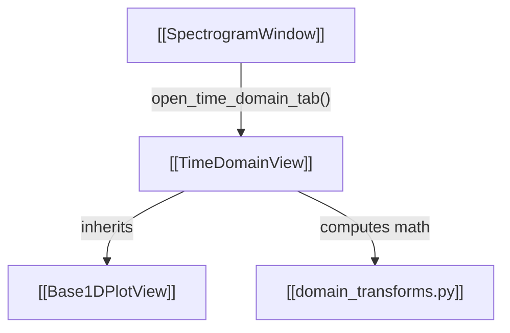

# Code Cartography Skill (Obsidian Knowledge Graph)

This skill provides the methodology and standards for mapping IQView's codebase into an interconnected **Obsidian knowledge graph** ("Code Cartography").

Opening the generated `cartography/` directory in [Obsidian](https://obsidian.md) enables an interactive, visual topology map via Obsidian's **Graph View** and **Canvas**.

For detailed Graph View query settings, forces, and color groups:
- [Obsidian Graph View & Canvas Guide](./references/obsidian_graph_guide.md)

---

## 1. Cartography Vault Directory Structure

The cartography graph lives in `cartography/` at the repository root:

```text
cartography/
├── 00 - Index (Map of Content).md    # The central hub linking to all domains
├── Architecture/                     # High-level architecture and domain MOCs
│   ├── MOC - Views Hierarchy.md
│   ├── MOC - DSP Pipeline.md
│   ├── MOC - Plugin Subsystem.md
│   └── MOC - IO and Formats.md
├── Views/                            # Analysis and plot view notes
├── MainWindow/                       # SpectrogramWindow and mixin notes
├── DSP/                              # Digital signal processing modules
├── Plugins/                          # Plugin runtime and overlay notes
├── IO/                               # File loaders, format parsers, and streaming
└── DataFlows/                        # End-to-end execution flow diagrams
```

---

## 2. Note Authoring Standards

To maximize the visual utility of Obsidian's **Graph View**, every note must follow these linking and metadata conventions:

### 2.1 Frontmatter & Tagging
Use standard YAML frontmatter with hierarchical tags. Tags allow Obsidian users to color-code clusters in the Graph View:

```yaml
---
type: view | dsp | plugin | io | mixin | flow | moc
tags:
  - code/ui/view
  - domain/time
file: iqview/ui/time_domain/view.py
inherits:
  - "[[Base1DPlotView]]"
---
```

#### Standard Tag Schema:
- `#code/ui/view`: All visualization widgets and dialogs
- `#code/ui/mixin`: Window mixins (`ViewControllerMixin`, etc.)
- `#code/dsp`: Pure math, filters, transforms, and readers
- `#code/plugin`: Plugin runtime, chains, and studio
- `#code/io`: Binary formats, audio, and hardware parsers
- `#code/flow`: Execution paths and data pipelines
- `#code/moc`: High-level hub notes (Maps of Content)

### 2.2 Bidirectional `[[Wikilinks]]`
Always use double-bracket Obsidian wikilinks: `[[Target Note Name]]` or `[[Target Note Name|Display Alias]]`.
Every component note must include:
1. **Inherits From / Implements**: Links to parent classes or interfaces.
2. **Depends On / Calls**: Links to internal modules it invokes.
3. **Used By / Spawned By**: Links to controllers or parents that instantiate it.

### 2.3 Visual Mermaid Diagrams
Incorporate Mermaid diagrams within component notes. In Obsidian, Mermaid blocks render natively inline:

````markdown

````

---

## 3. Recommended Graph View Color Palette for Obsidian

When opening the `cartography/` vault in Obsidian, configure **Graph View -> Groups** with the following filters and colors:

| Tag Filter | Category | Color | Hex Code |
| :--- | :--- | :--- | :--- |
| `tag:#code/moc` | Maps of Content (Hubs) | Vibrant Purple | `#9b5de5` |
| `tag:#code/ui/view` | UI Views & Dialogs | Sky Blue | `#00bbf9` |
| `tag:#code/ui/mixin` | Window Mixins | Teal | `#00f5d4` |
| `tag:#code/dsp` | DSP & Mathematics | Bright Green | `#52b788` |
| `tag:#code/plugin` | Plugin System | Orange | `#f15bb5` |
| `tag:#code/io` | File Formats & I/O | Warm Gold | `#fee440` |
| `tag:#code/flow` | Execution Flows | Coral Red | `#f72585` |

---

## 4. Maintenance & Workflow

When refactoring or adding new features to IQView:
1. Create a corresponding `.md` note in the appropriate `cartography/` subfolder.
2. Link it bidirectionally using `[[wikilinks]]` to its consumers and dependencies.
3. Add it to the relevant domain `[[MOC - ...]]` note.
4. If it alters an execution path, update the corresponding `[[Flow - ...]]` note.
