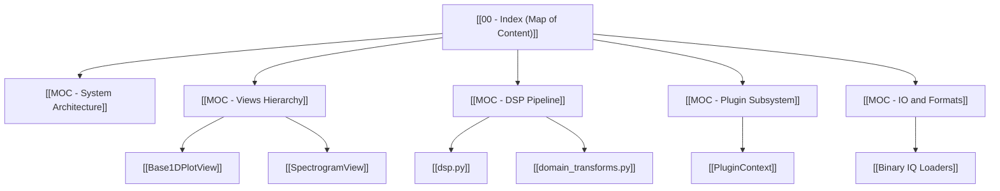

# 🗺️ IQView Codebase Cartography

Welcome to the **Code Cartography** knowledge graph for **IQView** — a high-performance, GPU-accelerated RF Spectrogram Viewer built with Python, PyQt6, pyqtgraph, and PyOpenGL.

This vault is structured for visual exploration in [Obsidian](https://obsidian.md). Open this folder (`cartography/`) as an Obsidian Vault and press **Ctrl+G** (or Cmd+G) to open the **Graph View**.

---

## 🧭 Maps of Content (MOCs)

Explore the architecture through five high-level domain hubs:

1. **[[MOC - System Architecture]]**: The overall architecture, application entry points, and [`SpectrogramWindow`](MainWindow/SpectrogramWindow.md) mixin structure.
2. **[[MOC - Views Hierarchy]]**: Complete visual taxonomy of all 2D, 1D, eye diagram, constellation, and detached analysis views.
3. **[[MOC - DSP Pipeline]]**: Pure signal processing routines, zero-phase filtering, PSD normalization, and coordinate alignment.
4. **[[MOC - Plugin Subsystem]]**: Plugin System 2.0, asynchronous background workers, parameter schemas, and overlays.
5. **[[MOC - IO and Formats]]**: File loaders, Tektronix `.r3f`, Keysight `.mat`, audio decoders, and stdin pipes.

---

## ⚡ Primary Execution DataFlows

Trace end-to-end signal paths from disk to display:
- **[[Flow - Viewport Lazy Spectrogram Rendering]]**: How visible slices are lazily processed without loading entire files into RAM.
- **[[Flow - Marker to Analysis Tab Slicing]]**: How time markers extract calibrated IQ segments into pop-up analysis tabs.
- **[[Flow - Plugin Execution and Overlay Ingestion]]**: How plugins execute asynchronously and yield interactive overlays back to the UI.

---

## 🎨 Recommended Graph View Tag Groups
In Obsidian, open **Graph View Settings -> Groups** and add these tag rules for color-coding:
- `#code/moc` $\rightarrow$ Purple (`#9b5de5`)
- `#code/ui/view` $\rightarrow$ Blue (`#00bbf9`)
- `#code/ui/mixin` $\rightarrow$ Teal (`#00f5d4`)
- `#code/dsp` $\rightarrow$ Green (`#52b788`)
- `#code/plugin` $\rightarrow$ Pink (`#f15bb5`)
- `#code/io` $\rightarrow$ Gold (`#fee440`)
- `#code/flow` $\rightarrow$ Red (`#f72585`)
