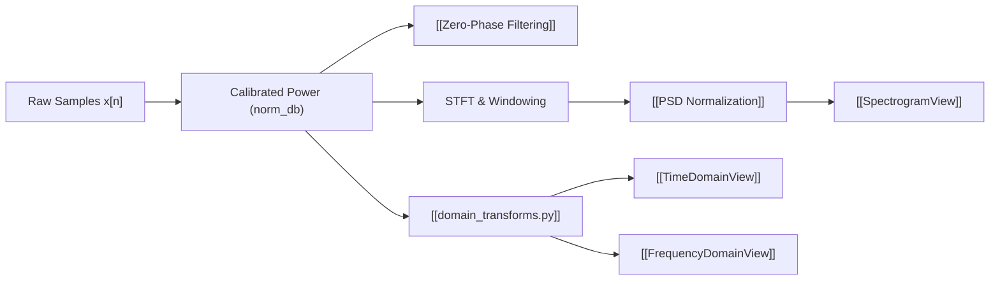

# ⚡ MOC - DSP Pipeline

The Digital Signal Processing subsystem in IQView is strictly decoupled from the Qt GUI layer. Pure mathematical operations are encapsulated in standalone modules and zero-phase algorithms.

---

## 🧮 Core Modules & Concepts

### 1. DSP Modules
- **[[dsp.py]]**: Core FFT preprocessing, window generation, `design_filter()`, and complex filtering (`apply_filter()`).
- **[[domain_transforms.py]]**: Pure NumPy/SciPy domain routines: `compute_instantaneous_frequency`, `compute_time_domain_trace`, `apply_signal_operator`, `compute_frequency_domain_fft`, and `compute_region_statistics`. **Zero GUI dependencies**.
- **[[utils.py (DSP Readers)]]**: Multithreaded readers:
  - `FileReaderThread`: Full-file processing.
  - `ViewportAwareReader`: On-demand viewport STFT calculation.
  - `MultiRowProcessor`: Stacked row segmentation.

### 2. Foundational Mathematical Invariants
- **[[Zero-Phase Filtering]]**: Forward-backward filtering (`sosfiltfilt`/`filtfilt`) eliminating group delay and making $\text{BSF} = \text{Original} - \text{BPF}$ exact.
- **[[PSD Normalization]]**: Window power normalization ($10\log_{10}(f_s \sum w^2[n])$) ensuring $\text{dB/Hz}$ spectral values are invariant to window type and FFT size.
- **[[Coordinate Alignment]]**: Window-center bounding box offset:
  $$\Delta t_{\text{offset}} = \frac{\text{window\_size}/2 - \text{step\_size}/2}{f_s}$$
  keeping visual FFT pixels aligned with underlying sample coordinates.

---

## 🔗 Related Notes
- [[00 - Index (Map of Content)]]
- [[MOC - Views Hierarchy]]
- [[Flow - Viewport Lazy Spectrogram Rendering]]
