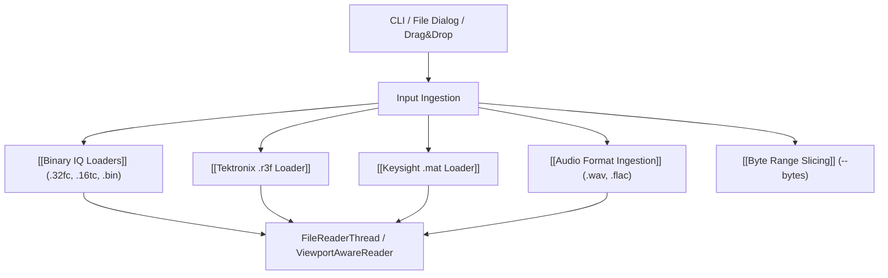

# 💾 MOC - IO and Formats

This Map of Content covers file loaders, streaming sources, byte range slicing, hardware parsers, and export pathways in IQView.

---

## 📂 Format Modules & Features

- **[[Binary IQ Loaders]]**: Direct parsing of complex floating-point (`complex64`, `complex128`), signed integer (`int16`), and real formats. Includes dynamic filename parameter auto-detection (`detect_params_from_filename`).
- **[[Tektronix .r3f Loader]]**: Native parser for Tektronix SignalVu-PC RSA captures. Parses 16 KB header frames for $F_c$, $F_{s,\text{real}}$, and IF center frequency, applying real-time DDC and decimation to complex baseband.
- **[[Keysight .mat Loader]]**: Ingestion of MATLAB files formatted with Keysight variables (`Y`, `XDelta`, `InputCenter`). Manages `.mat.overlays` sidecar files and structured `MatFileFormatError` dialogs.
- **[[Audio Format Ingestion]]**: Ingestion via `soundfile`/`scipy` supporting standard mono audio (`-t aud`) and deinterleaved complex IQ audio (`-t caudio`).
- **[[Byte Range Slicing]]**: Slicing arbitrary byte offsets with safe trailing byte alignment truncation to prevent `numpy.frombuffer` alignment errors.

---

## 🔗 Related Notes
- [[00 - Index (Map of Content)]]
- [[MOC - System Architecture]]
- [[Flow - Viewport Lazy Spectrogram Rendering]]
