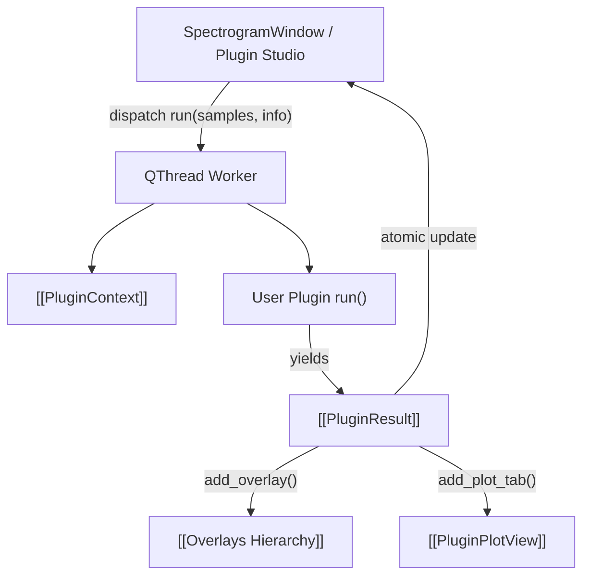

# 🔌 MOC - Plugin Subsystem

IQView features an asynchronous, modular plugin framework allowing DSP algorithms, burst detectors, and demodulators to execute on isolated background threads without freezing the Qt GUI.

---

## 🧩 Subsystem Components

### 1. Plugin Runtime
- **[[Plugin System 2.0]]**: Architectural overview of the plugin execution model, background threading, and cooperative cancellation.
- **[[PluginContext]]**: Context object (`info`) providing execution scope bounds, sample rate, center frequency, batch iteration (`iter_batches()`), progress reporting, cancellation checks, and tab launching.
- **[[PluginResult]]**: Return container for overlays, messages, custom 1D plot tabs, and errors.
- **[[PluginChain]]**: Declarative multi-step pipeline runner passing overlays and in-memory baseband IQ between consecutive plugin stages.

### 2. UI & Studio
- **[[PluginStudioDialog]]**: Interactive 3-tab dialog for managing plugins, building visual chains, and scaffolding new `.py` files with live Markdown documentation previews.
- **[[Overlays Hierarchy]]**: Interactive shapes rendered on the spectrogram (`Rect`, `Polygon`, `Ellipse`, `Line`, `XRegion`, `YRegion`), with per-burst baseband IQ caching (`o.iq`, `o.fs`).

---

## 🔗 Related Notes
- [[00 - Index (Map of Content)]]
- [[Flow - Plugin Execution and Overlay Ingestion]]
- [[MOC - Views Hierarchy]]
