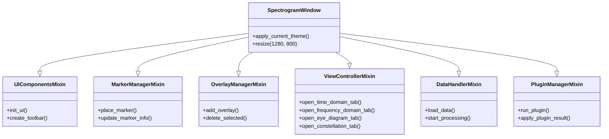

# 🏛️ MOC - System Architecture

IQView is structured around a composite main window class ([`SpectrogramWindow`](../MainWindow/SpectrogramWindow.md)) composed of multiple modular mixins that decouple UI construction, data handling, markers, overlays, view control, and plugin execution.

---

## 🧩 Architectural Modules

### Core Window & Mixins
- **[[SpectrogramWindow]]**: Central Qt container and window state orchestrator.
- **[[ViewControllerMixin]]**: Coordinates tab addition, large segment validation, and tab tear-off.
- **[[MarkerManagerMixin]]**: Manages spectrogram 2D markers, Delta/Center locks, and marker tables.
- **[[OverlayManagerMixin]]**: Handles drawing, selecting, locking, and JSON serialization of overlays.
- **[[ComponentSetupMixin]]**: Assembles toolbar actions, menus, shortcuts, and side panels.
- **[[DataHandlerMixin]]**: Manages data ingestion, background thread dispatch, and normalization.

### Subsystem Maps
- **[[MOC - Views Hierarchy]]**: Specialized 1D, 2D, and modulation analysis tabs.
- **[[MOC - DSP Pipeline]]**: Decoupled digital signal processing and spectral routines.
- **[[MOC - Plugin Subsystem]]**: Modular plugin execution, parameters, and in-memory caching.
- **[[MOC - IO and Formats]]**: File formats, streaming, and byte slicing.

---

## 🔗 Related Notes
- [[00 - Index (Map of Content)]]
- [[Flow - Viewport Lazy Spectrogram Rendering]]
- [[Flow - Marker to Analysis Tab Slicing]]
