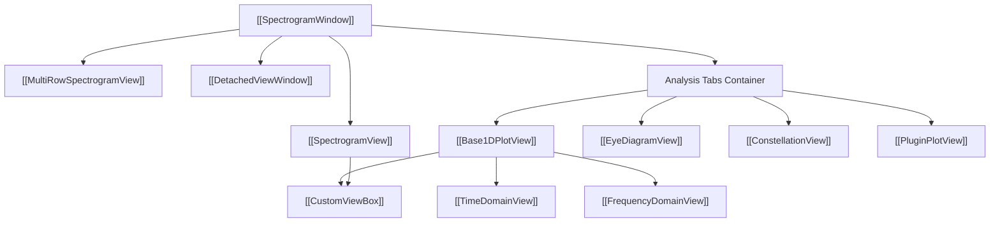

# 👁️ MOC - Views Hierarchy

This Map of Content catalogs all visualization views, analysis tabs, pop-up windows, and interaction controllers in IQView.

---

## 📊 Catalog of Views

### 1. 2D Spectrogram Displays
- **[[SpectrogramView]]**: GPU-accelerated primary OpenGL spectrogram with on-demand lazy rendering, standard and waterfall orientations, and draggable min/max level lines with $\text{dB/Hz}$ axis item.
- **[[MultiRowSpectrogramView]]**: Stacked multi-row spectrogram for unrolling periodic signals across $N$ vertically aligned rows with synchronized zooming and sample-exact periods.

### 2. 1D Signal Domain Subsystem ([`iqview/ui/base_1d/`](../Views/Base1DPlotView.md))
- **[[Base1DPlotView]]**: Unifying base class for 1D signal analysis. Manages marker hit-testing (minimum Euclidean distance), locked Delta/Center dragging, shadow continuation grids, endless markers, zoom history stack, and X/Y zoom scrollbars.
- **[[TimeDomainView]]**: Interactive time-domain trace analysis. Plot modes include `magnitude [dB]`, `Real`, `Imaginary`, `instant frequency`, and `Phase`. Handles real-signal Hilbert analytic conversion.
- **[[FrequencyDomainView]]**: Power Spectral Density ($\text{dB/Hz}$) and magnitude ($\text{dBFS}$) analysis. Features pre-transform signal operators (2nd power, 4th power, FM demod, Delay & Multiply) and live BPF/BSF filter overlays.

### 3. Specialized Modulation & Demodulation Views
- **[[EyeDiagramView]]**: Symbol timing, jitter, and ISI visualization. Features fractional $N_{\text{sps}}$ interpolation, 3-tier tuning sliders (Main, Coarse, Fine), SPS $\leftrightarrow$ Baud Rate cycling, and mini-overview segment handles.
- **[[ConstellationView]]**: Complex $I/Q$ plane scatter plot. Supports integer downsampling, sub-symbol phase offset, 2-tier phase rotation, 3-tier Carrier Frequency Offset (CFO) despinning, and trajectory overlays.
- **[[PluginPlotView]]**: Custom 1D subplots launched dynamically by plugins. Supports multiple curves, shaded state regions (`XRegion`), and statistics.

### 4. Window & Event Infrastructure
- **[[CustomViewBox]]**: Low-level pyqtgraph ViewBox managing mouse clicks, box zoom rectangles, panning, and marker event dispatch.
- **[[DetachedViewWindow]]**: Chrome-like undocking window allowing analysis tabs to be torn off to separate monitors with a "Dock Back" button.

---

## 🔗 Related Notes
- [[00 - Index (Map of Content)]]
- [[MOC - System Architecture]]
- [[Flow - Marker to Analysis Tab Slicing]]
