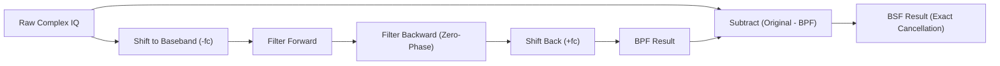

# 🛑 Zero-Phase Filtering

A critical mathematical invariant in IQView: all time-domain filtering must remain strictly zero-phase.

---

## 🔑 Why Zero-Phase Filtering is Mandatory

Standard causal filtering (`sosfilt` / `lfilter`) introduces non-linear phase distortion and group delay. Under causal filtering:
$$\text{BSF} \ne \text{Original} - \text{BPF}$$
Because phase shift prevents the passband energy from cancelling out cleanly, leaving heavy residuals.

Using forward-backward filtering (`scipy.signal.sosfiltfilt` or `filtfilt`):
1. **Zero Net Group Delay**: The filtered waveform is aligned with the original signal sample-for-sample.
2. **Exact Identity**: $\text{BSF} = \text{Original} - \text{BPF}$ is mathematically exact.

---

## 🔗 Related Notes
- [[MOC - DSP Pipeline]]
- [[dsp.py]]
- [[FrequencyDomainView]]
