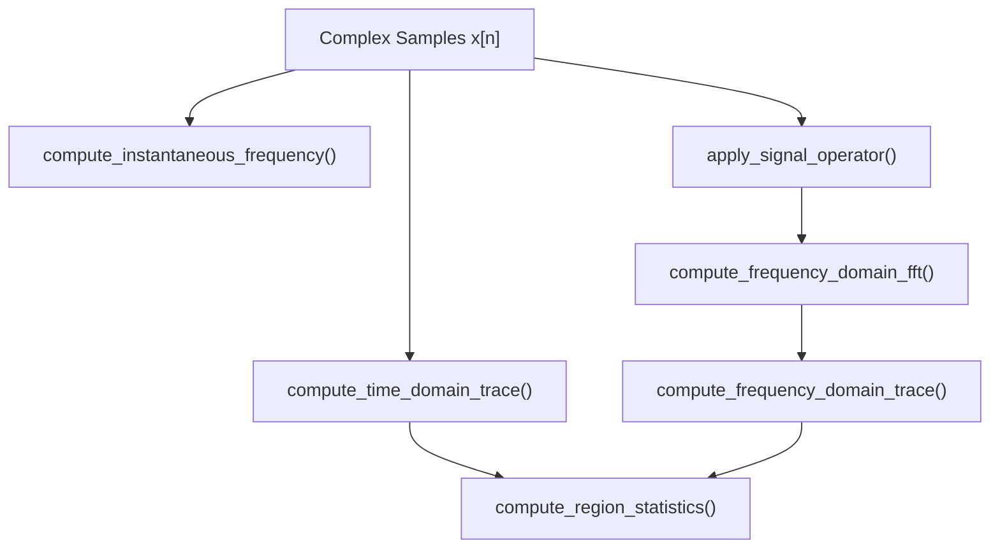

# 📐 domain_transforms.py

Encapsulates pure NumPy/SciPy domain transformations for 1D analysis views. Has **zero dependencies on PyQt6 or GUI code**.

---

## 🔑 Key Functions

- `compute_instantaneous_frequency(samples, sample_rate, median_filter_len)`:
  Computes instantaneous frequency via wrapped phase differentiation. Automatically applies Hilbert transform + DC-blocking HPF for real-valued signals.
- `compute_time_domain_trace(samples, mode, sample_rate, ...)`:
  Extracts specified trace mode (`magnitude [dB]`, `Real`, `Imaginary`, `instant frequency`, `Phase`, etc.).
- `apply_signal_operator(samples, operator_name, sample_rate)`:
  Applies preprocessing operators (`2nd Power`, `4th Power`, `FM Demod`, `Delay & Multiply`) prior to spectral analysis.
- `compute_region_statistics(x_axis, y_axis, b1, b2, ...)`:
  Calculates structured statistical metrics (`RegionStatsResult`): Mean, Median, Min, Max, 10th %, 90th %, and Integrated Power.

---

## 🔗 Related Notes
- [[MOC - DSP Pipeline]]
- [[TimeDomainView]]
- [[FrequencyDomainView]]
- [[dsp.py]]
