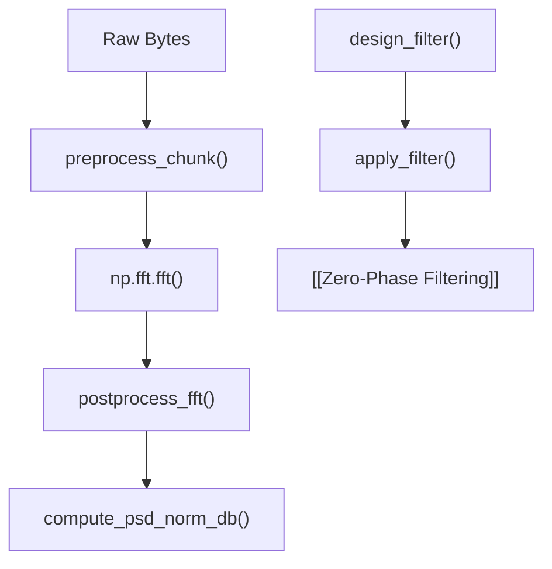

# 🧮 dsp.py

The core digital signal processing library implementing STFT chunk preprocessing, FFT postprocessing, filter design, and complex zero-phase filtering.

---

## 🔑 Key Functions

- `preprocess_chunk(data_array, window, fft_size)`: De-interleaves I and Q to complex64 and applies window function.
- `compute_psd_norm_db(window, sample_rate)`: Computes $10\log_{10}(f_s \sum w^2[n])$ normalization offset in $\text{dB/Hz}$.
- `postprocess_fft(fft_result, fft_size, psd_norm_db)`: Applies `fftshift`, clips to $\epsilon = 10^{-12}$, and converts to decibels.
- `design_filter(fs, f_min, f_max, filter_type, ...)`: Designs SOS or FIR filters (Elliptic, Butterworth, Chebyshev I/II, Bessel, FIR).
- `apply_filter(data, fs, f_min, f_max, ...)`: Applies zero-phase baseband-shifted filtering (`sosfiltfilt` / `filtfilt`).
- `compute_psd(samples, fs, method)`: Computes Welch or Periodogram PSD.

---

## 🔗 Related Notes
- [[MOC - DSP Pipeline]]
- [[domain_transforms.py]]
- [[Zero-Phase Filtering]]
- [[PSD Normalization]]
