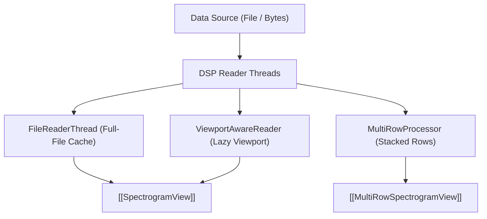

# 🧵 utils.py (DSP Readers)

Contains the multithreaded readers responsible for reading raw samples, computing Short-Time Fourier Transforms (STFT), and feeding the display engines.

---

## ⚡ Reader Classes

1. **`FileReaderThread`**:
   - Computes the full-file static spectrogram cache up to $\approx 20,000$ rows.
   - Emits progress and finished signals.
2. **`ViewportAwareReader`**:
   - The engine behind **Lazy Mode**.
   - Slices only the visible time segment $[t_{\text{start}}, t_{\text{end}}]$ and computes $4 \times \text{pixel\_width}$ FFT rows on-demand.
   - Enables exploring multi-gigabyte recordings with flat, bounded RAM consumption.
3. **`MultiRowProcessor`**:
   - Computes row slices for the multi-row stacked spectrogram view.

---

## 🔗 Related Notes
- [[MOC - DSP Pipeline]]
- [[SpectrogramView]]
- [[MultiRowSpectrogramView]]
- [[Flow - Viewport Lazy Spectrogram Rendering]]
