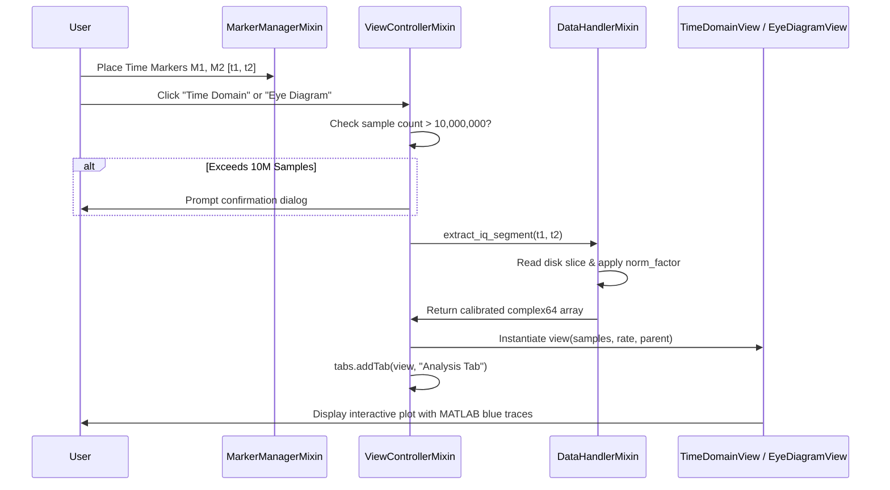

# 🔄 Flow - Marker to Analysis Tab Slicing

Traces how user-placed time markers extract calibrated IQ segments into pop-up analysis tabs.

---

## 🔗 Related Notes
- [[MOC - Views Hierarchy]]
- [[ViewControllerMixin]]
- [[TimeDomainView]]
- [[EyeDiagramView]]
