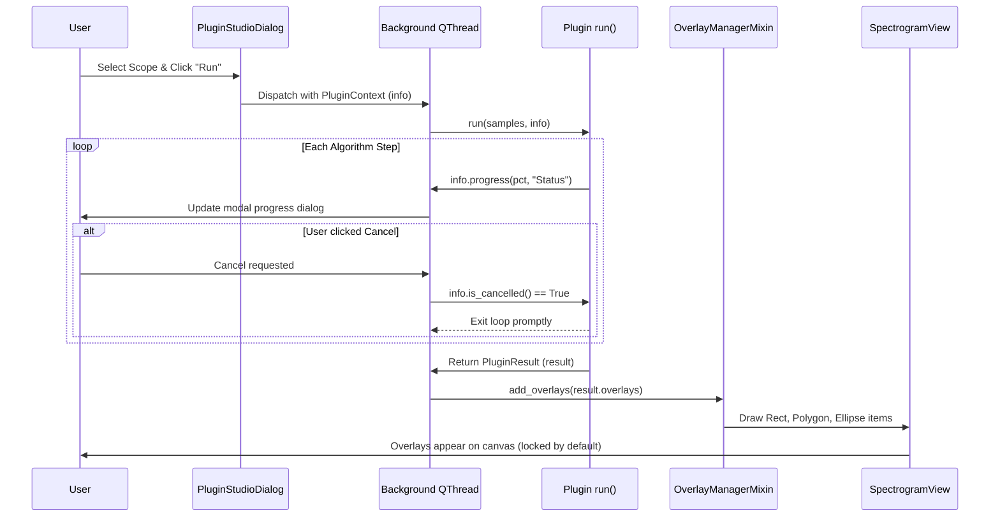

# 🔄 Flow - Plugin Execution and Overlay Ingestion

Traces the asynchronous execution of plugins and the atomic injection of overlays back into the main UI.

---

## 🔗 Related Notes
- [[MOC - Plugin Subsystem]]
- [[Plugin System 2.0]]
- [[PluginContext]]
- [[Overlays Hierarchy]]
