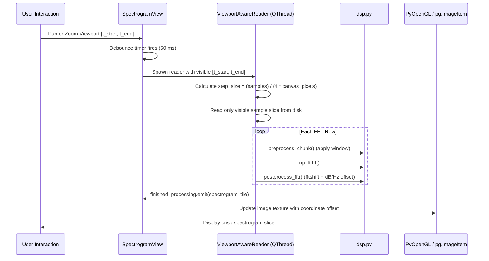

# 🔄 Flow - Viewport Lazy Spectrogram Rendering

Traces how IQView renders multi-gigabyte captures in milliseconds without RAM exhaustion.

---

## 🔗 Related Notes
- [[MOC - DSP Pipeline]]
- [[SpectrogramView]]
- [[utils.py (DSP Readers)]]
- [[Coordinate Alignment]]
