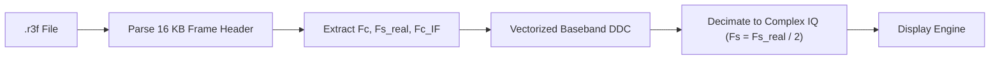

# 📻 Tektronix .r3f Loader

Native loader and Digital Down-Converter for Tektronix RSA spectrum analyzer `.r3f` captures.

---

## ⚡ Core Capabilities

- Parses the 16 KB header frame for RF center frequency ($F_c$), real ADC rate ($F_{s,\text{real}}$), and IF center frequency ($F_{c,\text{IF}}$).
- Performs real-time vectorized Digital Down-Conversion (DDC) and decimation to complex IQ baseband ($F_s = F_{s,\text{real}} / 2$).
- Raises structured `R3FFileFormatError` on corrupt or non-compliant headers.

---

## 🔗 Related Notes
- [[MOC - IO and Formats]]
- [[Binary IQ Loaders]]
