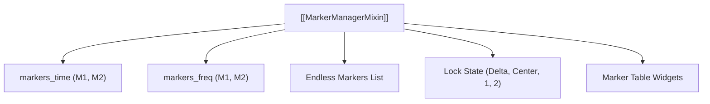

# 📍 MarkerManagerMixin

Controls 2D spectrogram time and frequency marker state machines, locked Delta/Center constraints, and table synchronization.

---

## ⚡ Core Capabilities

- **Marker Modes**:
  - `TIME`: Two fixed vertical lines ($M_1, M_2$).
  - `FREQ`: Two fixed horizontal lines ($M_1, M_2$).
  - `TIME_ENDLESS` & `FREQ_ENDLESS`: Arbitrary numbers of secondary lines.
- **Lock State Machine**:
  - `Delta Lock`: Fixed span $|M_2 - M_1|$. Adaptively clamps against file boundaries.
  - `Center Lock`: Fixed midpoint $(M_1 + M_2)/2$. Symmetrical expansion/contraction.
  - `Single Lock` (`1` / `2`): Freezes one marker while allowing the other to move.

---

## 🔗 Related Notes
- [[SpectrogramWindow]]
- [[CustomViewBox]]
- [[MOC - Views Hierarchy]]
