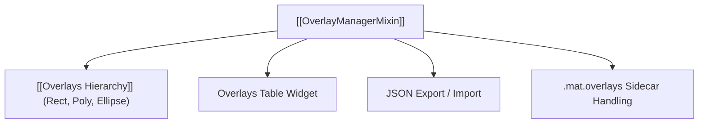

# 📐 OverlayManagerMixin

Coordinates user-drawn and plugin-generated geometric overlays rendered atop the spectrogram.

---

## ⚡ Core Capabilities

- **Interactive Manipulation**:
  - Dragging, resizing, and vertex editing for arbitrary polygons.
  - Locking individual overlays to prevent accidental movement.
- **Serialization**:
  - Exports overlays to JSON with capture metadata (`fs`, `fc`, FFT size, window type).
  - Automatically loads and saves `.mat.overlays` sidecars when working with Keysight `.mat` files.

---

## 🔗 Related Notes
- [[SpectrogramWindow]]
- [[Overlays Hierarchy]]
- [[MOC - Plugin Subsystem]]
