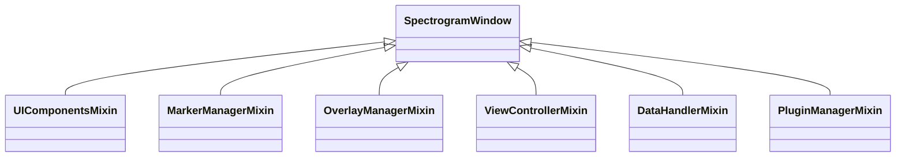

# 🖥️ SpectrogramWindow

The central `QMainWindow` container and orchestrator of IQView. Combines six modular mixins into a unified application interface.

---

## ⚡ Core Mixins Composition

1. **[[ComponentSetupMixin]]**: Initializes UI layout, menus, toolbars, and dock widgets.
2. **[[ViewControllerMixin]]**: Manages analysis tabs, large segment confirmation, and detached windows.
3. **[[MarkerManagerMixin]]**: Controls 2D spectrogram time and frequency markers, locked delta/center, and table updates.
4. **[[OverlayManagerMixin]]**: Manages drawing, selecting, and JSON export/import of overlays.
5. **[[DataHandlerMixin]]**: Coordinates data loading, thread dispatching, and file reloading.
6. **PluginManagerMixin**: Manages plugin loading, execution dialogs, and results application.

---

## 🔗 Related Notes
- [[MOC - System Architecture]]
- [[ViewControllerMixin]]
- [[SpectrogramView]]
