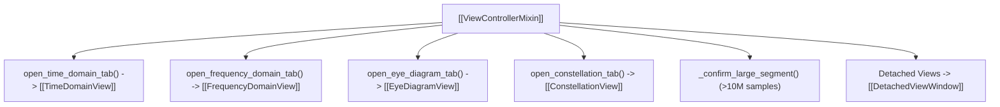

# 🎮 ViewControllerMixin

Responsible for tab creation, analysis view spawning, large segment confirmation, and tab tear-off lifecycle.

---

## 🔑 Key Methods

- `open_time_domain_tab()`: Extracts the marked time slice and adds a `TimeDomainView` tab.
- `open_frequency_domain_tab()`: Extracts the marked time slice and adds a `FrequencyDomainView` tab.
- `open_eye_diagram_tab()`: Extracts the marked time slice and adds an `EyeDiagramView` tab.
- `open_constellation_tab()`: Extracts the marked time slice and adds a `ConstellationView` tab.
- `_confirm_large_segment(start_t, end_t, tab_name)`: Warns the user when requesting $>10,000,000$ samples to prevent freezes.
- `on_parameters_changed(params)`: Recalculates time duration, axis limits, and level regions when $f_s$, $f_c$, or `norm_db` changes.

---

## 🔗 Related Notes
- [[SpectrogramWindow]]
- [[MOC - Views Hierarchy]]
- [[Flow - Marker to Analysis Tab Slicing]]
