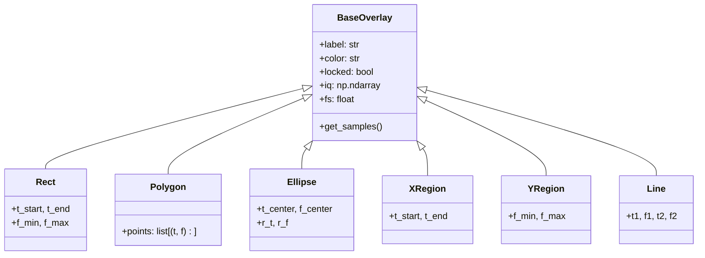

# 📐 Overlays Hierarchy

Geometric and annotation shapes rendered interactively over the 2D spectrogram.

---

## ⚡ Baseband IQ Caching (`o.iq`, `o.fs`)

- Overlays can store baseband IQ slices directly in memory (`o.iq = burst_samples`).
- When downstream algorithms invoke `o.get_samples()`:
  1. If `o.iq` is present, it returns cached samples instantly with **zero disk I/O**.
  2. If `o.iq` is absent, it performs lazy Digital Down-Conversion (DDC) from the parent capture file.

---

## 🔗 Related Notes
- [[Plugin System 2.0]]
- [[PluginResult]]
- [[OverlayManagerMixin]]
