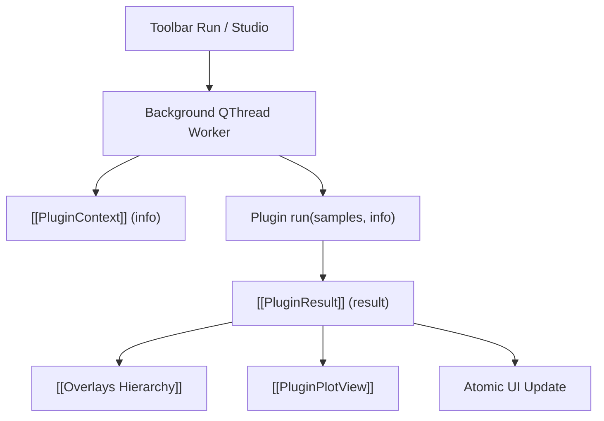

# 🔌 Plugin System 2.0

IQView's asynchronous plugin framework allowing signal processing scripts to run in background worker threads with cooperative cancellation, live UI progress, and interactive overlays.

---

## 🔑 Core Features

1. **Object-Oriented API**:
   - `run(samples: np.ndarray, info: PluginContext) -> PluginResult`
2. **Dynamic UI-Bound Parameters (`PLUGIN_PARAMS`)**:
   - Declares schemas for float, integer, boolean, string, and choice inputs.
3. **Cooperative Cancellation**:
   - `PluginCancelledError` inherits from `BaseException` (cannot be swallowed by `except Exception:`).
4. **Memory-Bounded Batching**:
   - `PLUGIN_BATCH_SECONDS` and `info.iter_batches()` for streaming large files without RAM exhaustion.
5. **Baseband IQ Caching (`o.iq`, `o.fs`)**:
   - Burst detectors attach baseband IQ directly to overlays; downstream plugins read them via `o.get_samples()` with zero disk I/O.

---

## 🔗 Related Notes
- [[MOC - Plugin Subsystem]]
- [[PluginContext]]
- [[PluginResult]]
- [[PluginChain]]
- [[Overlays Hierarchy]]
- [[Flow - Plugin Execution and Overlay Ingestion]]
