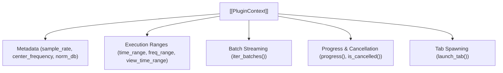

# 📦 PluginContext

The execution context object (`info`) passed into every plugin's `run()` function.

---

## ⚡ Available Attributes & Methods

- `info.params`: Dictionary of user-configured parameter values.
- `info.sample_rate`: Sample rate ($f_s$) of the capture.
- `info.center_frequency`: RF center frequency ($f_c$).
- `info.time_range`: Active time bounds `(t_start, t_end)`.
- `info.freq_range`: Active frequency bounds `(f_min, f_max)`.
- `info.overlays`: List of existing overlays present on the spectrogram.
- `info.iter_batches(batch_seconds, overlap_seconds)`: Generator yielding chunked sample slices.
- `info.progress(percent, message)`: Reports progress to the modal dialog.
- `info.is_cancelled()`: Returns `True` if user clicked Cancel.
- `info.launch_tab(view_type, samples, ...)`: Spawns native analysis tabs (`"time"`, `"freq"`, `"eye"`, `"scatter"`).

---

## 🔗 Related Notes
- [[Plugin System 2.0]]
- [[PluginResult]]
- [[MOC - Plugin Subsystem]]
