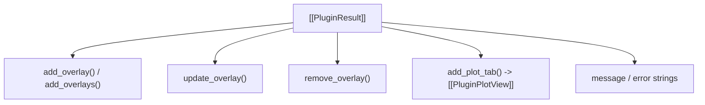

# 📤 PluginResult

The return container yielded by a plugin's `run()` function.

---

## ⚡ Core Capabilities

- `result.add_overlay(shape)`: Schedules a newly created overlay (`Rect`, `Polygon`, `Ellipse`, etc.) for injection onto the spectrogram.
- `result.update_overlay(shape)`: Modifies properties or coordinates of an existing overlay.
- `result.remove_overlay(shape)`: Safely deletes an overlay generated by a plugin.
- `result.add_plot_tab(title, x_label, y_label)`: Creates an interactive 1D sub-plot tab ([`PluginPlotView`](../Views/PluginPlotView.md)).
- `result.message = "..."`: Informative status message displayed upon completion.

---

## 🔗 Related Notes
- [[Plugin System 2.0]]
- [[PluginContext]]
- [[Overlays Hierarchy]]
- [[PluginPlotView]]
