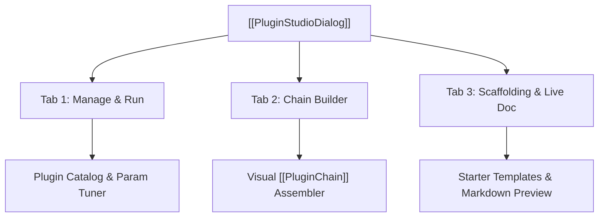

# 🎨 PluginStudioDialog

A visual development and execution suite for IQView plugins.

---

## ⚡ 3-Tab Suite

1. **Manage & Run**:
   - Lists all loaded built-in and custom plugins.
   - Allows configuring dynamic parameters, selecting execution scope (`"view"`, `"markers"`, `"full_file"`), and running plugins.
2. **Chain Builder**:
   - Visually arranges plugins into sequential multi-stage pipelines.
3. **Scaffolding & Live Docs**:
   - Generates boilerplate starter templates.
   - Provides a live real-time Markdown preview of `PLUGIN_DOC`.

---

## 🔗 Related Notes
- [[Plugin System 2.0]]
- [[PluginChain]]
- [[MOC - Plugin Subsystem]]
