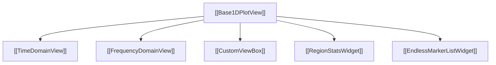

# 📈 Base1DPlotView

`Base1DPlotView` is the shared base class for 1D interactive signal analysis views in IQView ([`TimeDomainView`](TimeDomainView.md) and [`FrequencyDomainView`](FrequencyDomainView.md)).

---

## 🔑 Key Responsibilities

1. **pyqtgraph Interaction Protocol**:
   - Manages mouse events via [`CustomViewBox`](CustomViewBox.md).
   - Strictly keeps `movable=False` on `InfiniteLine` to preserve table synchronization.
2. **Marker Hit-Testing**:
   - Uses strict **minimum Euclidean distance** (`min_dist`) to select the closest marker within 20px, avoiding mis-selection near clustered markers.
3. **Marker Locking & Boundary Clamping**:
   - Handles `Marker 1`, `Marker 2`, `Delta`, and `Center` locks.
   - Adaptively clamps marker pairs against viewport boundaries during fast drags so pairs slide smoothly to the edge without freezing.
4. **Shadow Continuation Grids**:
   - Computes cyclic shadow markers with 50 ms throttling (`_do_update_grid`).
   - Supports dragging shadow lines without teleporting primary markers.
5. **Zoom & Pan Stack**:
   - Synchronized X and Y zoom scrollbars (`update_scrollbars`, `scroll_view`).
   - Pushes zoom states to `zoom_history` for multi-level `Ctrl+Z` undo.

---

## 🔗 Related Notes
- [[MOC - Views Hierarchy]]
- [[TimeDomainView]]
- [[FrequencyDomainView]]
- [[CustomViewBox]]
