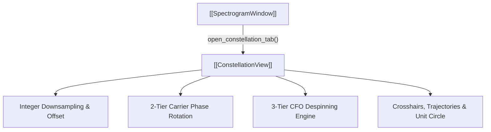

# ✨ ConstellationView (Scatter Plot)

Visualizes complex In-phase / Quadrature ($I/Q$) constellation diagrams and provides real-time carrier phase and frequency offset tuning.

---

## ⚡ Core Capabilities

- **Integer Downsampling & Strobe Offset**:
  - Downsampling factor $N$ (e.g. 8 for 8 SPS).
  - Sub-symbol offset slider ($0 \dots N-1$) to select the exact symbol decision instant.
- **Two-Tier Phase Rotation Sliders**:
  - Coarse ($\pm 180^\circ$) and Fine ($\pm 10^\circ$) phase adjustments:
    $$x_{\text{rot}}[n] = x[n] \cdot e^{j \phi_{\text{rad}}}$$
- **Three-Tier CFO Despinning**:
  - Dynamically scaled by sample rate $f_s$:
    - Coarse: $\pm f_s / 2$
    - Medium: $\pm f_s / 2000$
    - Fine: $\pm f_s / 2,000,000$
    $$x_{\text{despun}}[n] = x[n] \cdot e^{-j 2\pi f_{\text{CFO}} t[n]}$$
- **Visual Overlays**:
  - Point size adjustment, trajectory line tracing, unit circle overlay, and $I/Q$ axis crosshairs.

---

## 🔗 Related Notes
- [[MOC - Views Hierarchy]]
- [[EyeDiagramView]]
- [[SpectrogramWindow]]
