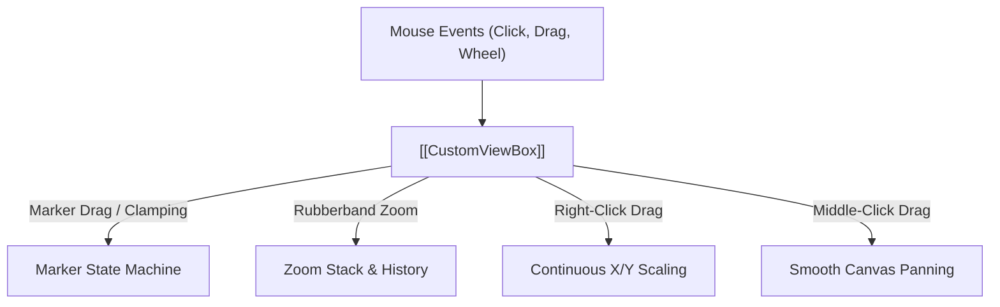

# 📦 CustomViewBox

A specialized subclass of `pyqtgraph.ViewBox` that serves as the central mouse event, navigation, and marker interaction engine across all IQView plot canvases.

---

## 🔑 Invariants & Rules

1. **Central Dispatcher**:
   - `CustomViewBox` manages all marker hit-testing, dragging, and adaptive boundary clamping.
   - **Never set `movable=True` on `InfiniteLine`**; doing so bypasses `CustomViewBox` and breaks table synchronization.
2. **Momentary Keybind Modes**:
   - Manages momentary hold modes (`Hold Ctrl` for Zoom, `Hold Space` for Pan), reverting cleanly upon key release.
3. **Boundary Clamping**:
   - Enforces adaptive clamping so locked marker pairs slide smoothly against boundaries rather than freezing.

---

## 🔗 Related Notes
- [[Base1DPlotView]]
- [[SpectrogramView]]
- [[MOC - Views Hierarchy]]
