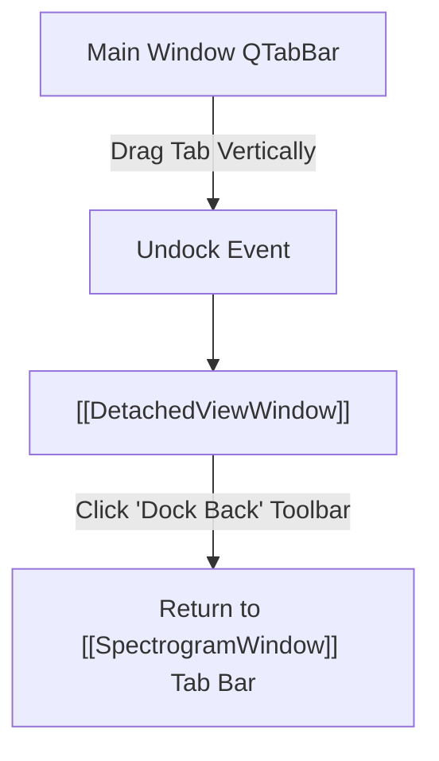

# 🪟 DetachedViewWindow

Provides Chrome-like tab undocking capabilities, allowing any secondary analysis view to be torn off into an independent desktop window.

---

## ⚡ Core Capabilities

- **Tab Tear-Off & Re-Docking**:
  - Dragging a tab vertically out of the main tab bar tears off the view into a standalone `QMainWindow`.
  - Includes a dedicated **"Dock Back"** toolbar button to return the view back to the main window's tab bar.
- **Multi-Monitor Support**:
  - Allows spreading Time Domain, Frequency Domain, Eye Diagram, and Constellation views across multiple monitors while keeping all data and markers live.
- **Spectrogram Tab Pinning**:
  - The primary **Spectrogram** tab remains pinned at index 0 and cannot be undocked or displaced.

---

## 🔗 Related Notes
- [[MOC - Views Hierarchy]]
- [[SpectrogramWindow]]
- [[ViewControllerMixin]]
