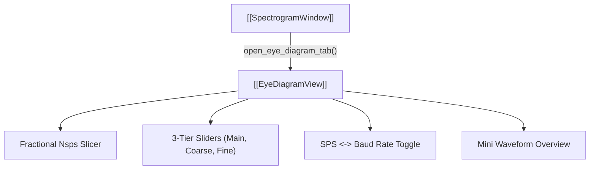

# 👁️ EyeDiagramView

An interactive analysis tab for evaluating symbol timing, clock jitter, and inter-symbol interference (ISI).

---

## ⚡ Core Capabilities

- **Fractional $N_{\text{sps}}$ Slicing**:
  - Interpolates samples so non-integer samples-per-symbol values produce sharp, open eye traces without discretization jitter.
- **Three-Tier Slider System**:
  - **Main Slider**: Large adjustment span ($\pm 50\%$).
  - **Coarse Slider**: Medium precision ($\pm 2\%$).
  - **Fine Slider**: Micro-tuning ($\pm 0.1\%$).
- **Baud Rate $\leftrightarrow$ SPS Cycling**:
  - Toggle button switches sliders and spinboxes between physical Baud Rate (Hz) and raw Samples-Per-Symbol ($N_{\text{sps}} = f_s / \text{Baud}$).
- **Mini Waveform Overview**:
  - Displays the full extracted segment at the bottom with two draggable handles to focus the eye diagram on specific packet preambles or bursts.
- **Safety Cap**:
  - Bounded by `MAX_EYE_SAMPLES = 500_000` to guarantee 60 FPS slider responsiveness.

---

## 🔗 Related Notes
- [[MOC - Views Hierarchy]]
- [[ConstellationView]]
- [[TimeDomainView]]
