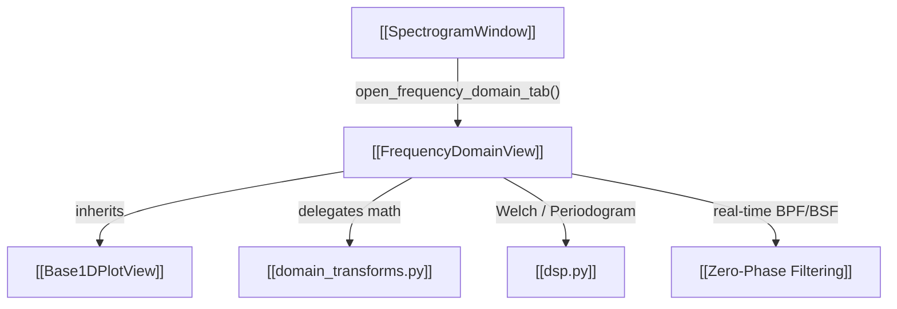

# 📶 FrequencyDomainView

Provides 1D spectral visualization, Power Spectral Density (PSD), preprocessing operators, and integrated channel power.

---

## ⚡ Core Capabilities

- **Plot Modes**:
  1. `power spectrum density (PSD)`: Scaled in true $\text{dB/Hz}$ via Welch or Periodogram method with window energy normalization.
  2. `magnitude [dBFS]`: Normalized to full-scale decibels ($20\log_{10}(|X[k]|/N)$).
- **Preprocessing Operators**:
  - `None (Normal)`: Direct spectrum.
  - `2nd Power` ($x[n]^2$): Enhances BPSK/QPSK carrier leakage.
  - `4th Power` ($x[n]^4$): Isolates carrier frequency offset spikes at $4 \times f_{\text{CFO}}$.
  - `FM Demod`: Computes instantaneous frequency prior to FFT.
  - `Delay & Multiply` ($x[n] \cdot x^*[n-1]$): Yields discrete spectral lines at baud-rate harmonics.
- **Integrated Channel Power**:
  - Computes $\sum S_{xx}(f) \cdot \Delta f$ within active frequency marker brackets or statistics regions.
- **Live Filtering Overlays**:
  - Allows drawing and tuning interactive BPF (`[`) and BSF (`]`) directly over the frequency curve.

---

## 🔗 Related Notes
- [[Base1DPlotView]]
- [[TimeDomainView]]
- [[PSD Normalization]]
- [[domain_transforms.py]]
