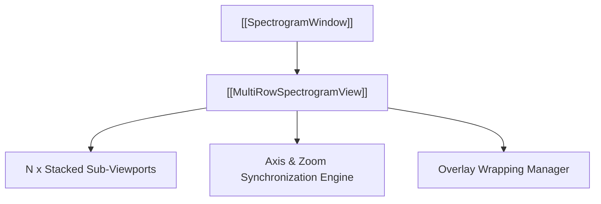

# 📑 MultiRowSpectrogramView

Visualizes periodic or pulsed RF signals by slicing the recording across $N$ vertically stacked, synchronized viewports.

---

## ⚡ Core Capabilities

- **Sample-Indexed Period Control**:
  - `samples_per_row`: Duration in samples per row.
  - `period`: Cycle interval in samples (e.g. 20,000 samples for 2 ms at 10 Msps). Slicing off-period (e.g. 19,900) produces a diagonal pulse tilt confirming exact sample-level resolution.
  - `start_sample`: Phase alignment offset to shift the vertical alignment.
- **Bi-Directional Axis Sync**:
  - Zooming or panning any row instantly updates all $N$ rows simultaneously.
  - Frequency bounds and relative time spans stay perfectly matched.
- **Overlay & Marker Distribution**:
  - Shapes drawn in a single row wrap and project onto corresponding time slices in adjacent rows.

---

## 🔗 Related Notes
- [[MOC - Views Hierarchy]]
- [[SpectrogramView]]
- [[CustomViewBox]]
