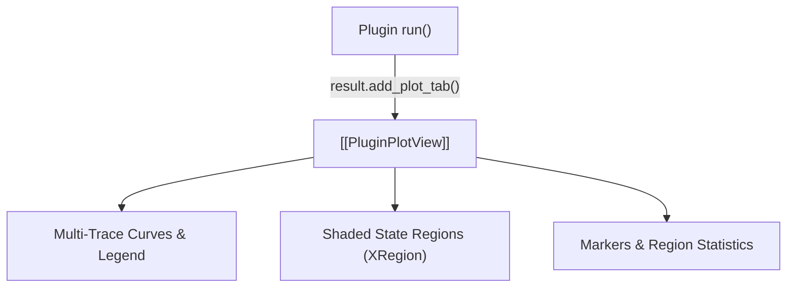

# 📊 PluginPlotView

A reusable 1D multi-trace plot tab spawned dynamically by plugins via `result.add_plot_tab()`.

---

## ⚡ Core Capabilities

- **Multi-Trace Rendering**:
  - Plots arbitrary scalar arrays (e.g., matched-filter correlation profiles, FM demod traces, energy envelopes) with custom colors and labels.
- **Protocol State Regions**:
  - Supports shaded vertical state regions (`XRegion`) for visualizing preamble sync sequences, payload boundaries, or packet headers.
- **Analysis Integration**:
  - Full support for interactive markers, X/Y zoom scrollbars, and region statistics.

---

## 🔗 Related Notes
- [[MOC - Plugin Subsystem]]
- [[PluginResult]]
- [[MOC - Views Hierarchy]]
