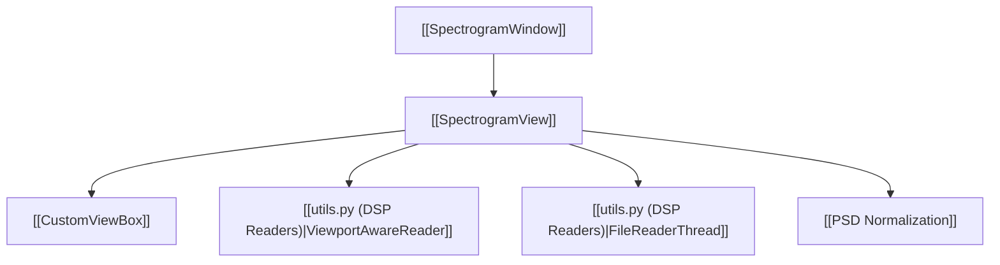

# 🌌 SpectrogramView

The primary 2D visualization surface in IQView, providing GPU-accelerated rendering of the Short-Time Fourier Transform (STFT).

---

## ⚡ Core Capabilities

- **Lazy vs Full Rendering**:
  - In Lazy Mode, `ViewportAwareReader` computes only the visible viewport slice at $4 \times \text{canvas\_pixels}$ width on-demand.
  - In Full Mode, zooming beyond 50% automatically switches to high-resolution viewport calculation, preventing bitmap pixelation.
- **Orientation Modes**:
  - **Standard**: $X = \text{Time}$, $Y = \text{Frequency}$.
  - **Waterfall**: $X = \text{Frequency}$, $Y = \text{Time}$ ($t=0$ at top, progressing downwards).
  - Explicitly tracks `_applied_waterfall` to avoid spurious axis flips during settings updates.
- **Colorbar & Power Calibration**:
  - Draggable min/max level lines (`level_region`) synchronized with an integrated `ColorbarAxisItem` displaying $\text{dB/Hz}$.
  - Shifts dynamically when RF power normalization (`norm_db`) or sample rate ($f_s$) changes.
- **Interactive Navigation**:
  - `Hold Ctrl` + Left-drag: Box zoom.
  - `Hold Space` + Left-drag or Middle-drag: Pan.
  - Right-drag: Continuous dynamic X/Y scaling.
  - `Ctrl+Z`: Multi-level undo.

---

## 🔗 Related Notes
- [[MOC - Views Hierarchy]]
- [[MultiRowSpectrogramView]]
- [[CustomViewBox]]
- [[Flow - Viewport Lazy Spectrogram Rendering]]
