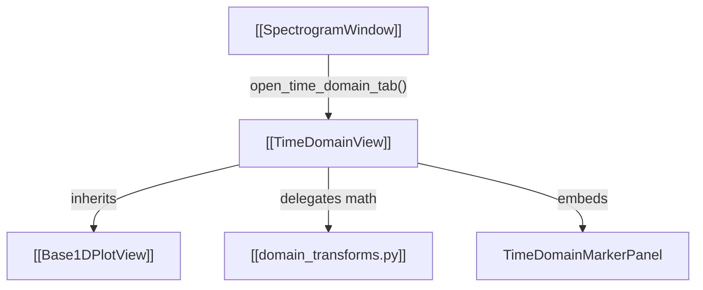

# ⏳ TimeDomainView

Provides detailed 1D time-domain trace visualization for complex IQ and real-valued signal segments.

---

## ⚡ Core Capabilities

- **Plot Modes**:
  1. `magnitude [dB]`: $20 \log_{10}(|x[n]| + \epsilon)$
  2. `Real`: $\text{Re}(x[n])$
  3. `Imaginary`: $\text{Im}(x[n])$
  4. `instant frequency`: Wrapped phase differentiation with Hilbert preprocessing for real signals
  5. `Phase`: Raw phase angle in radians
  6. `Unwrapped phase`: Continuous phase accumulation
  7. `magnitude`, `magnitude^2`, `magnitude^2 [dB]`
- **Real-Signal Processing**:
  - Automatically identifies real signals and converts them to analytic signals via Hilbert transform + DC-blocking Butterworth HPF prior to instantaneous frequency computation.
- **Statistical Extrema & Distribution**:
  - Extrema point markers (Red circle = Max, Green triangle = Min).
  - Full-plot dotted lines for 10th percentile (green) and 90th percentile (red).
- **Styling**:
  - Traces adhere strictly to MATLAB blue (`#0072BD`, width `0.5`).

---

## 🔗 Related Notes
- [[Base1DPlotView]]
- [[FrequencyDomainView]]
- [[domain_transforms.py]]
- [[Flow - Marker to Analysis Tab Slicing]]
